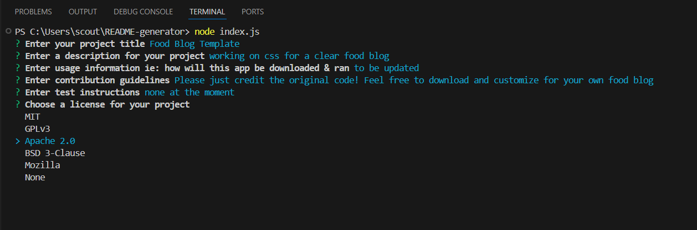
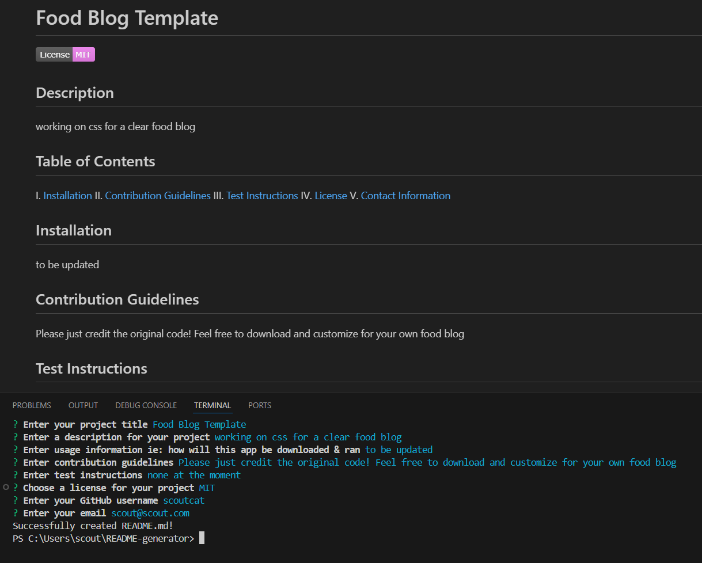

# Professional README Generator

# Table of Contents
 I. [User Story](#user-story)  
 II. [Acceptance Criteria](#acceptance-criteria)  
 III. [Links to Video Walk-through](#walk-through-video)  
 IV. [Image of Working App](#example-of-app)  
 V. [Helpful Resources](#helpful-resources)  
 VI. [Source Code Credit](#starter-code-credit-httpsgithubcomcoding-boot-camppotential-enigma)  

## User Story:
> - AS a developer
> - I WANT a README generator using the command-line
> - SO THAT I can quickly create a professional README.md file for new projects using **Inquirer** 

## Acceptance Criteria:
- GIVEN a command-line application that accepts user input
- WHEN I am prompted for info about my app repository
- THEN a high-quality, professional README.md is generated with the title of my project and sections entitled Description, Table of Contents, Installation, Usage, License, Contributing, Tests, and Questions
- WHEN I enter various fields (ie: title, description, usage information)
- THEN this information is displayed in the correct sections of the README
- WHEN I click on links in the Table of Contents
- Then they function and I am taken to the corresponding section of the README

## Walk-Through Video:

[DEMO HERE](https://watch.screencastify.com/v/Xb5e4kTcceWPcqFeX6q7)

## Example of App

**Command line at work**:

**README.md example created with the app**:

### Helpful Resources:
> [How to create a Professional README- Full-Stack Blog](https://coding-boot-camp.github.io/full-stack/github/professional-readme-guide)  
> [Inquirer Docs on npmjs.com](https://www.npmjs.com/package/inquirer#installation) 
> [Shields.io for creating badges](https://shields.io/) 
> [Video Submission Guide- Full-Stack Blog](https://coding-boot-camp.github.io/full-stack/computer-literacy/video-submission-guide)

### starter code credit: https://github.com/coding-boot-camp/potential-enigma